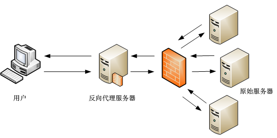
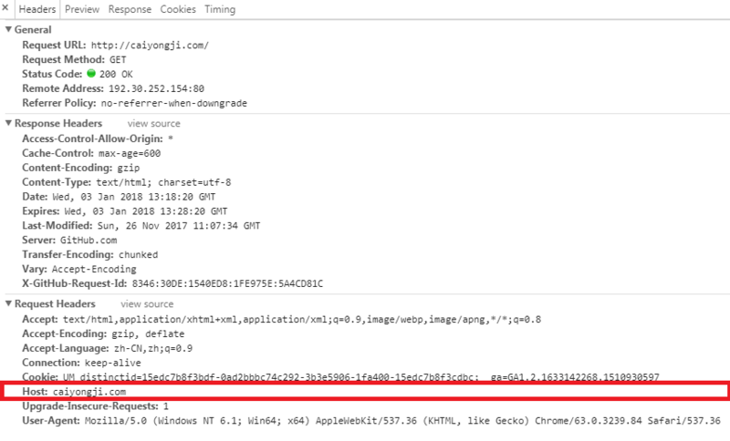
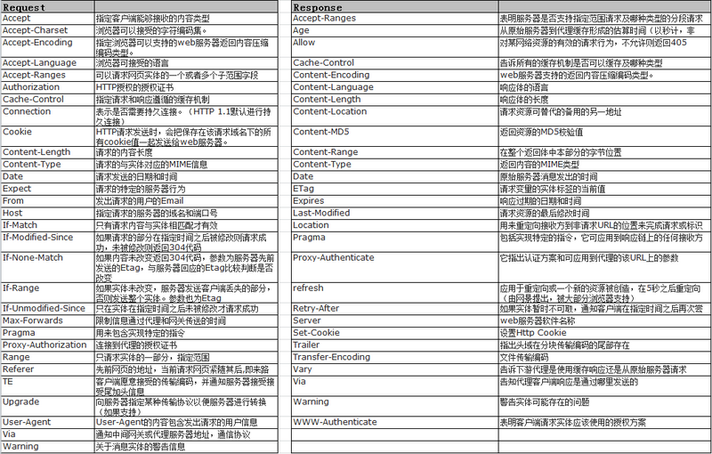
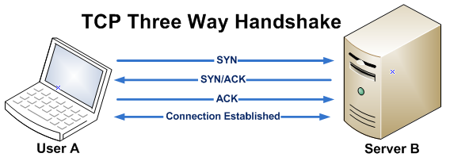
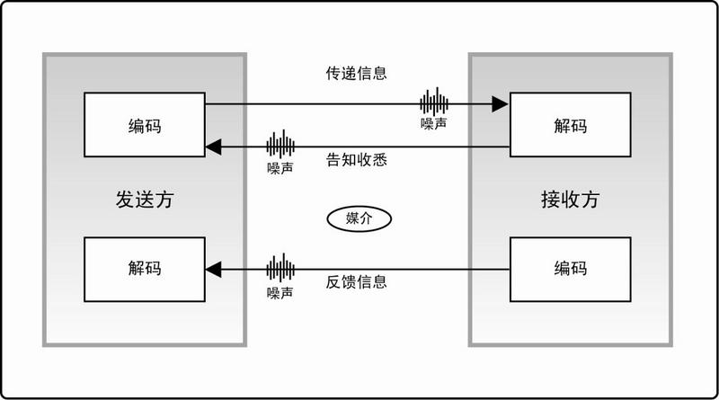

我们想象一下，用户输入网址进行HTTP请求，DNS服务器找到域名对应的IP地址，连接IP地址对应的服务器，那么服务器是如何知道用户是通过A域名还是B域名找到自己的呢？
本文旨在通过通信协议的例子让你更加深入了解HTTP以及一些小技巧，包括反向代理，HTTP报文，三次握手，DNS解析，DNS污染/劫持，HTTPS等。需要注意的是，本文碎片化的知识点实际上涵盖了很多方向和领域，大家可以针对自己的爱好进行有深度的涉猎。

从实际应用到理论支持，我们由"深"入"浅"，透过现象寻找本质。

#  反向代理解析多域名
反向代理的作用就是作为中间层来访问内网站点，防止了直接将内容服务器暴露给外网，起到了安全防护的作用，也同样可以实现负载均衡、限流。





我们看一下Nginx上多域名配置的代码：
```
server
{
    listen 80;
    server_name A.com;
    location / {
        proxy_pass http://localhost:11111;
    }
}
server
{
    listen 80;
    server_name B.com;
    location / {
        proxy_pass http://localhost:22222;
    }
}
```

如上代码所示，A/B域名分别对应主机11111/22222端口。
可以看出，反向代理Nginx可以获取到HTTP请求中的域名。由此可以推断出DNS解析并不是单纯的将域明转换成IP地址。那么我们看一下HTTP报文是什么样子。

# HTTP报文
我们打开Chrome监控HTTP请求，可以看到下图所示：



其中request中Host属性在整个HTTP请求中始终存在，并且不可更改，这也就是Nginx反向代理服务器所判断域名的依据。

HTTP的Request和Response的全部属性如下图所示：




# TCP三次握手
HTTP协议(应用层)是基于TCP协议(传输层)的，并非从属关系。HTTP通信同样需要三次握手。
举个例子：

> A：请求通话。(SYN)
> B：请求通话。收到。(SYN+ACK)
> A：收到。(ACK)





其中SYN代表同步，ACK代表确认。三次握手本身的设计就像是一个君子协议，之所以进行三次握手而非两次握手是为了解决网络延迟所造成的重新分组问题(可以理解为聊天过程中网络延迟导致的答非所问)。
三次握手与项目管理中的沟通模型一样：



细细体会，现实沟通中的"传递信息"，"告知收悉"，"反馈信息"和三次握手是一样的。

# DNS解析
DNS服务器是key-value(域名-IP地址)对应的缓存服务器，当HTTP请求中host记录不在本地缓存时，向根(root)服务器转移解析请求。
#### DNS劫持
劫持DNS服务器，进而修改其解析结果。
#### DNS污染
对DNS查询进行入侵检测，发现与黑名单上匹配的请求，该服务器就伪装成DNS服务器，给查询者返回虚假结果。它利用了UDP协议是无连接不可靠性。

DNS解析、CDN加速、VPN网关，这些通信层的东西面涉及到很多知识，我就不过多阐述了。我只说一点，大多数成熟的黑客技术都是基于互联网**协议**的。

# HTTP与HTTPS
HTTPS中的s代表secure，也可以理解为`HTTPS = HTTP + SSL`。
HTTP默认80端口，HTTPS默认443端口。同时，HTTPS对传输的数据进行加密。
更直观的感受是，访问HTTPS站点需要确认服务器的公钥和加密的证书，进而保证了数据传输的安全。

通信协议层的东西比较散，我并没有在上下文中进行较强的因果逻辑推断，因而显得知识点比较碎片化。通信层的东西本身和编程关系不大，但这些容易被程序员忽略的知识，往往像是一个纽带一样连接编程概念中的各个知识体系。希望本文对你有所帮助。
